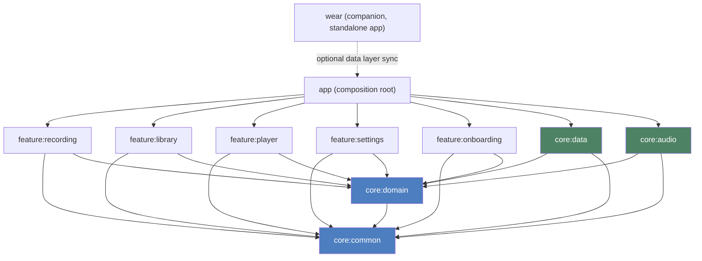
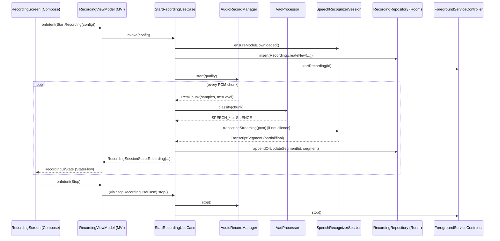
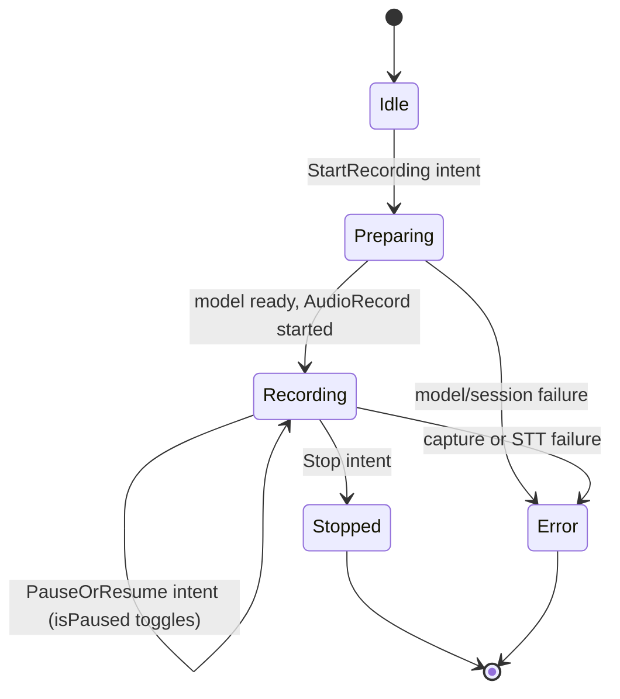
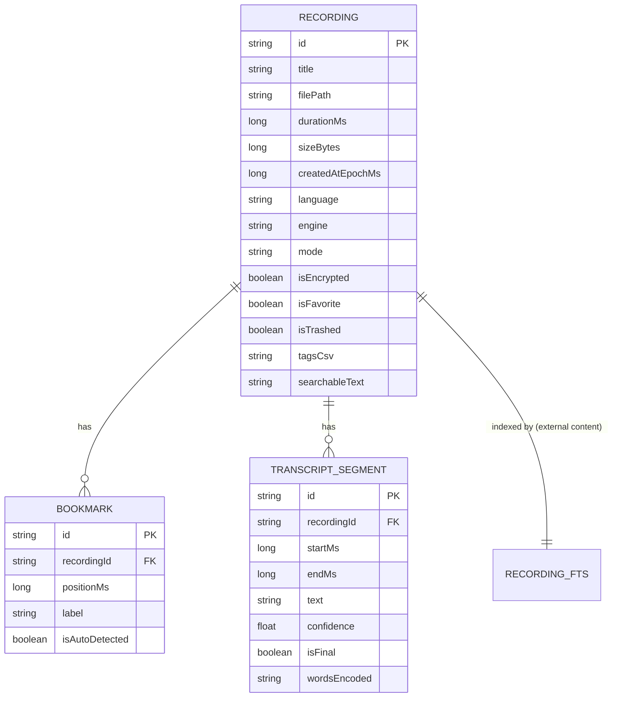

# Architecture

VoiceScribe follows Clean Architecture (domain / data / presentation) with
an MVI presentation layer, split into Gradle modules along both axes:
`core:*` for shared, feature-agnostic layers, `feature:*` for one screen
area each. Module boundaries are enforced by the build graph, not just by
convention — see `docs/adrs/0005-domain-is-pure-kotlin.md`.

## Module graph

Rules the graph is meant to make visually obvious:

- `feature:*` modules depend only on `core:common` and `core:domain`. They
  never depend on `core:data` or `core:audio` directly — those are wired in
  at runtime through Koin, from `app`'s composition root
  (`VoiceScribeApplication`). A feature module cannot accidentally reach
  into Room or `AudioRecord`.
- `core:domain` and `core:common` depend on nothing Android. They're plain
  `kotlin("jvm")` Gradle modules; the dependency arrows into them are the
  only thing every other module has in common.
- `core:data` and `core:audio` are peers: both implement domain ports
  (`RecordingRepository`/`SettingsRepository` and
  `AudioCaptureController`/`SpeechRecognizerProvider`/`ForegroundServiceController`
  respectively) and neither depends on the other.

## The recording pipeline (streaming mode)

## MVI shape (feature:recording, feature:library — same pattern everywhere)

Every screen follows the same three-type shape:
`*Intent` (what the user/system asked for) -> a reducer inside the
ViewModel -> `*UiState` (one immutable snapshot, exposed as `StateFlow`) plus
`*Effect` (one-shot events — navigation, snackbars — exposed as a
`Channel`-backed `Flow` so they aren't redelivered on configuration change).

## Data model

See `docs/adrs/0004-fts4-instead-of-fts5.md` for why search is Room-native
FTS4 rather than raw FTS5, and `core/data`'s `RecordingRepositoryImpl` KDoc
for why list queries return recordings without their bookmarks/segments
hydrated (an intentional N+1 avoidance).

## Why these specific trade-offs

Every non-obvious architectural choice in this codebase has a short,
dedicated writeup in `docs/adrs/`:

- **0001** — Koin over Hilt
- **0002** — AudioRecord (not MediaRecorder) feeds the STT pipeline
- **0003** — STT engines behind a port + factory (isolates the early-access ML Kit GenAI API)
- **0004** — Room-native FTS4 instead of hand-rolled FTS5
- **0005** — `core:common`/`core:domain` are pure Kotlin/JVM, enforced by the build graph
- **0006** — hand-rolled `.docx`/PDF export instead of Apache POI/iText

Read `STT_ENGINES.md` and `PRIVACY_SECURITY.md` alongside this document —
together the three cover "how it's built," "how speech recognition is
chosen," and "what happens to the user's data," respectively.
